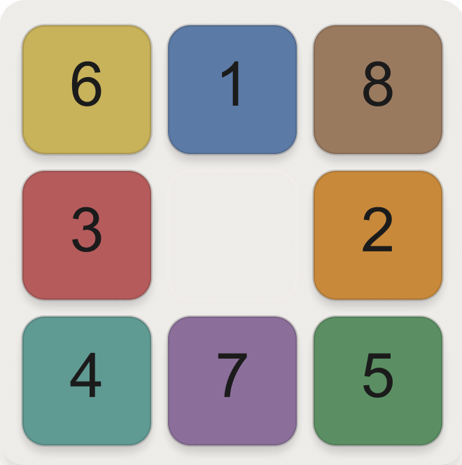
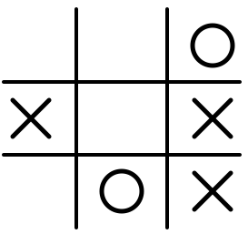
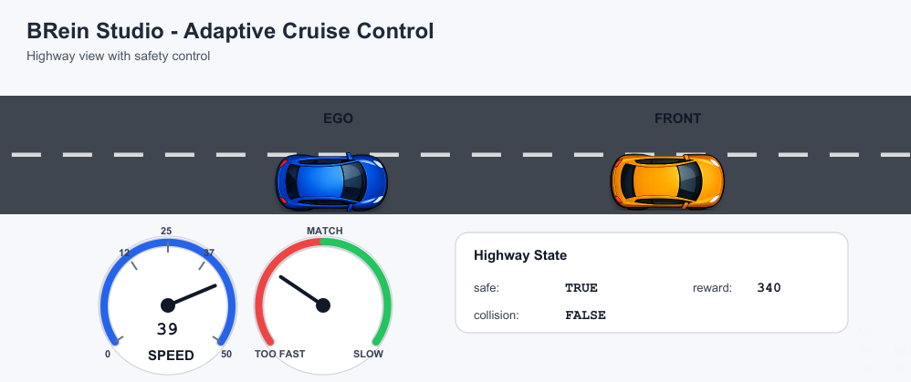
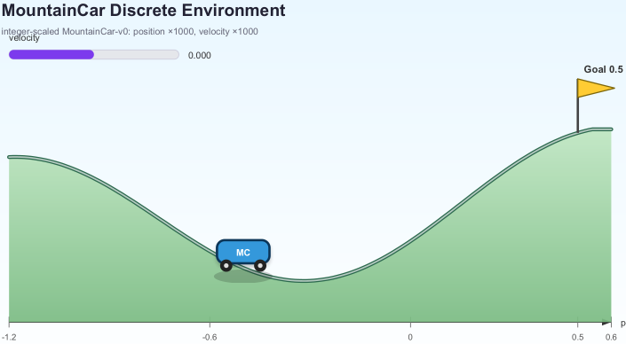

# Environments

{: .info }
> **Info**
>
> This page is under construction.

## Safe cab taxi driver

  

    
  

  

    

      The Taxi Driver environment models a grid-based city in which an agent must
      pick up a passenger, avoid dangerous cells, and deliver the passenger to a target
      destination.
    

    

      <a href="taxi-driver">Open Taxi Driver →</a>
    

  

## Puzzle

  

    
  

  

    

      <a href="puzzle">Open Puzzle →</a>
    
 
  

## Tic-Tac-Toe

  

    
  

  

    

      Coming soon.
    

    <!-- 

      <a href="taxi-driver">Open Taxi Driver →</a>
    
 -->
  

## Adaptive cruise control

  

    
  

  

    

      Coming soon.
    

    <!-- 

      <a href="taxi-driver">Open Taxi Driver →</a>
    
 -->
  

## Mountain car

  

    
  

  

    

      Coming soon.
    

    <!-- 

      <a href="taxi-driver">Open Taxi Driver →</a>
    
 -->
  

