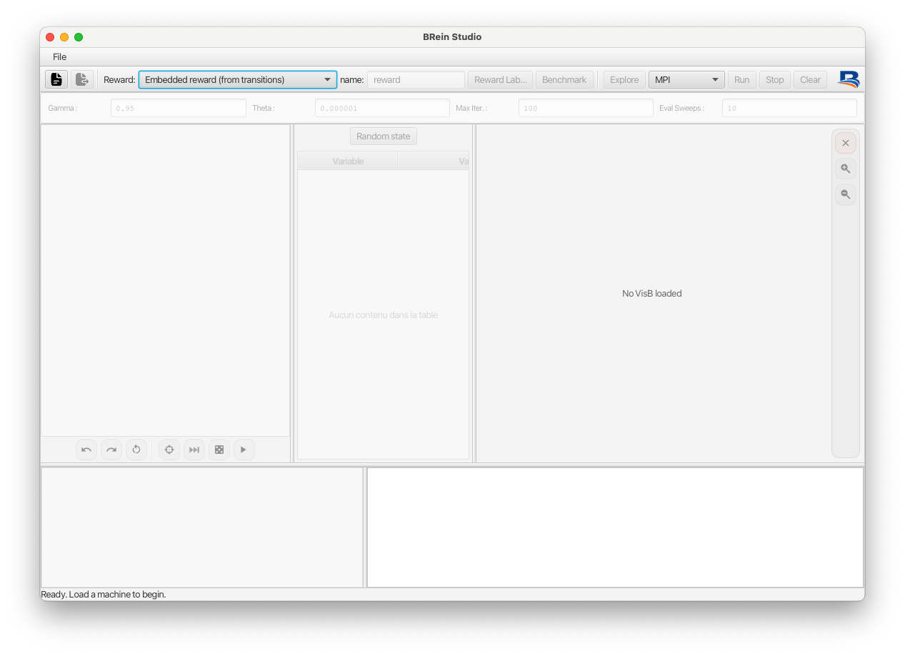

# Getting Started

BRein Studio is a user friendly tool. Once a B machine and its visualization are loaded, the framework automatically exposes it as an RL environment and provides access to several model-free and model-based learning algorithms.

<p align="center">
  
</p>

## Step 1 — Open a B Machine

Start by loading an executable B specification:

```text
File → Open Machine...
```

Select the machine (`.mch`) that defines the environment. Once loaded, ProB initializes the model and makes its operations available for exploration and learning.

## Step 2 — Load a VisB Visualization

To obtain a graphical representation of the environment, load the corresponding VisB specification:

```text
File → Open VisB...
```

Select the associated JSON file.

The visualization is optional but highly recommended, as it provides an intuitive view of the current state during animation and learning.

## Step 3 — Select a Reward Mode

BRein Studio supports several ways of defining rewards.

- **Embedded Reward from Transitions**: The reward is returned directly by the B specification and attached to transitions generated by ProB. This is the recommended mode for most environments.

- **Once-and-for-All Registered Formula**: 
A reward formula is registered once and evaluated automatically for every visited state.
This allows reward shaping without modifying the original B machine.

- **On-the-Fly Ad-Hoc Formula** *(Experimental)*: A reward expression can be entered interactively and evaluated during execution. This feature is useful for rapid experimentation but should be considered experimental.

## Step 4 — Select a Learning Algorithm

Choose one of the available algorithms from the algorithm selector.

### Model-Free Reinforcement Learning

- SARSA
- Q-Learning
- Dyna-Q
- Dyna-Q+

These algorithms interact directly with the environment and do **not** require a complete state-space exploration beforehand.

### Model-Based Reinforcement Learning / Dynamic Programming

- Value Iteration
- Policy Iteration
- Modified Policy Iteration (MPI)
- Prioritized Value Iteration
- Backward Induction

These algorithms require knowledge of the complete transition system.

Before running them, press:

```text
Explore
```

This instructs ProB to generate the entire reachable state space of the specification, prior to learning.

## Step 5 — Configure Hyperparameters and Run

Depending on the selected algorithm, configure the available parameters:

- Discount factor (`γ`)
- Learning rate (`α`)
- Exploration rate (`ε`)
- Maximum iterations
- Evaluation sweeps
- Planning steps

Then press:

```text
Run
```

BRein Studio will execute the learning algorithm and display the resulting values, policies, rewards, and execution traces.

## Typical Workflow

```text
Open Machine
      ↓
Open VisB
      ↓
Select Reward Mode
      ↓
Choose Algorithm
      ↓
(Explore if using Dynamic Programming)
      ↓
Configure Hyperparameters
      ↓
Run
```

