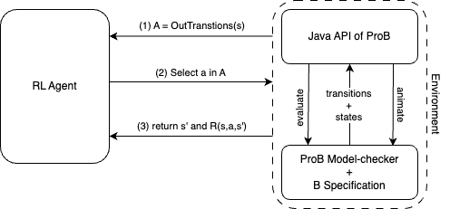

# Safe Reinforcement Learning from B Models

Learn policies directly from executable B specifications using ProB.

[Download](download){: .btn .btn-primary }
[Explore Environments](environments){: .btn }
[GitHub Repository](https://github.com/brein-studio/brein-studio){: .btn }

## What is BRein Studio?

BRein Studio connects Reinforcement Learning algorithms with executable B specifications.

Instead of manually implementing the environment dynamics, the agent interacts directly with a formally specified system through the ProB animator and model checker.

  

