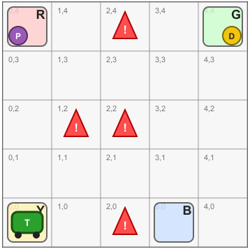
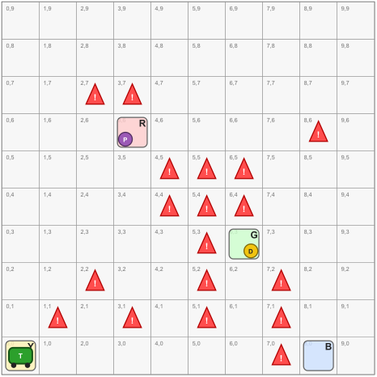
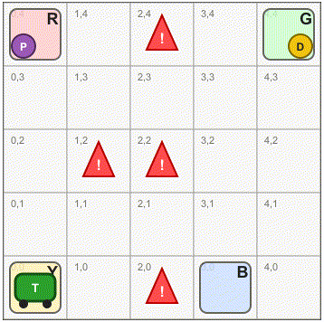

# Taxi Driver (SafeCab)

{: .info }
> **Classic Reinforcement Learning Environment**
>
> The Taxi Driver environment is inspired by the well-known Taxi problem. The agent must navigate a grid world, pick up a passenger, and deliver it to the requested destination while avoiding dangerous cells.

### Contributors
- Akram Idani (<akram.idani@univ-grenoble-alpes.fr>)
- Natacha Maffo Fonkou ([Grenoble INP - ENSIMAG](https://ensimag.grenoble-inp.fr/en))
- Rayane Idani ([Lycée Champollion - Grenoble](https://lycee-champollion.fr))

## Resources

Clone the repository:

```bash
git clone https://github.com/brein-studio/brein-studio.git
```

The Taxi Driver environment is located in:

```text
brein-studio/taxi_driver
```

## Quick Tour

- Open machine `SafeTaxiDriver_5_5.mch`,
- Load the VisB file `TaxiDriverEnvironment.visb.json`,
- Select reward mode **Once-and-For-All (subscribed state formula)**,
- Enter `ManhattanDistance` (or any other reward defined in `rewards.def`),
- Choose **MPI**,
- Click **Explore**, then **Run**,
- To automatically execute the learned policy, click **⏭**.

## Overview

The core environment logic is defined once in the machine `SafeTaxiDriver.mch`. Rewards are defined in file `rewards.def`. Concrete environments are created through separate machines that include this generic specification and instantiate the grid parameters. The repository  provides two predefined instances:

- **`SafeTaxiDriver_5_5.mch`**: a compact 5×5 city;
- **`SafeTaxiDriver_10_10.mch`**: a larger 10×10 city with additional dangerous areas.

Users can easily create their own grids by defining new machines that include `SafeTaxiDriver.mch` and provide different grid dimensions, landmarks, and danger zones.

### Example Instances

<div class="env-card">
<div class="env-code">
<pre>
MACHINE
    SafeTaxiDriver_5_5
INCLUDES
    SafeTaxiDriver
PROMOTES
    south, north, east, west, pickup, dropoff
DEFINITIONS
    "rewards.def" ;  
PROPERTIES
    locCount = 4
    & maxX = 4
    & maxY = 4   
    & locX = { 1|->0, 2|->4, 3|->0, 4|->3 }
    & locY = { 1|->4, 2|->4, 3|->0, 4|->0 }
    & Danger = { 2|->4, 1|->2, 2|->2, 2|->0 }
END
</pre>
</div>
<div class="env-image">
  
</div>
</div>


<div class="env-card">
<div class="env-code">
<pre>
MACHINE
    SafeTaxiDriver_10_10
INCLUDES
    SafeTaxiDriver
PROMOTES
    south, north, east, west, pickup, dropoff
DEFINITIONS
    "rewards.def" ; 
PROPERTIES
    locCount = 4
    & maxX = 9
    & maxY = 9
    & locX = { 2|->6, 1|->3, 3|->0, 4|->8 }
    & locY = { 2|->3, 1|->6, 3|->0, 4|->0 }
    & Danger = {
        1|->1, 2|->2, 3|->1,
        4|->4, 5|->4, 6|->4,
        4|->5, 5|->5, 6|->5,
        5|->1, 5|->2, 5|->3,
        2|->7, 3|->7, 8|->6
        7|->2, 7|->1, 7|->0
    }
END
</pre>
</div>
<div class="env-image">
  
</div>
</div>

At the beginning of each episode:

- the taxi is placed at a valid location,
- a passenger waits at one of the landmarks,
- a destination is selected,

The objective is to transport the passenger to the destination while maximizing the cumulative reward.

## Action Space

The agent can perform the following actions:

| Action | Description |
|----------|----------|
| North | Move north |
| South | Move south |
| East | Move east |
| West | Move west |
| Pickup | Pick up the passenger |
| Dropoff | Drop off the passenger |

## Reward Functions

Different reward functions are defined in `rewards.def`. 

| Reward | Description |
|----------|----------|
| `reward` | Sparse reward. The agent receives a large reward only when the passenger is successfully delivered. |
| `ManhattanDistance` | Dense reward based on the Manhattan distance to the current objective (passenger or destination). |
| `PhaseBonus` | Reward shaping that distinguishes the pickup and delivery phases through additional bonuses. |
| `Quadratic_Distance` | Stronger distance-based shaping using a quadratic penalty. |
| `Simplified_Exponential` | Non-linear shaping that rapidly increases rewards near the objective. |
| `Combined_Attraction` | Simultaneously attracts the taxi toward the passenger and the destination. |

### Example

<pre>
reward ==
  IF delivered = 1 THEN
     1000
  ELSE
     -1
  END;
</pre>

<p align="center">
  
</p>

